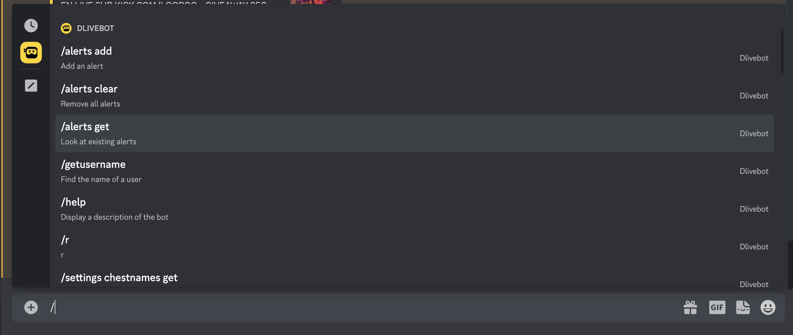

# DLiveBot

A discord bot that send notifications when DLive streamers go live.

## Features

- Discord slash commands
- Multiple servers support
- Rich message notification
- Customizable settings per server

## Examples

## Dependencies

- NodeJS 16.6.0+
- Google Cloud Firestore service account

## Installation

- Create a Google Cloud [service account](https://cloud.google.com/iam/docs/creating-managing-service-account-keys)
- Create your bot and get its [token](https://discordjs.guide/preparations/setting-up-a-bot-application.html#creating-your-bot)
- Fill the [.env file](.env) with the information from above
- Invite the bot to your [Discord server](https://discordjs.guide/preparations/adding-your-bot-to-servers.html#bot-invite-links) (with permissions _Send Messages_, _Embed Links_, _Mention @everyone_)

## Basic usage

**Commands may only be run in a channel that contains _alert_**

_You need admin privileges by default_

- Setup an alert

Use the following command in the channel where you wish to receive notifications

`/alerts add <displayname>`

- Help

Use the `/help` command
